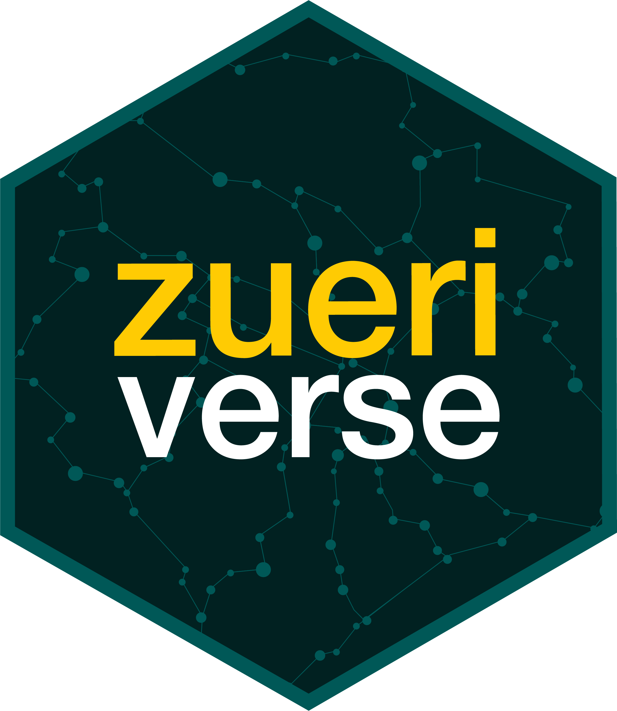
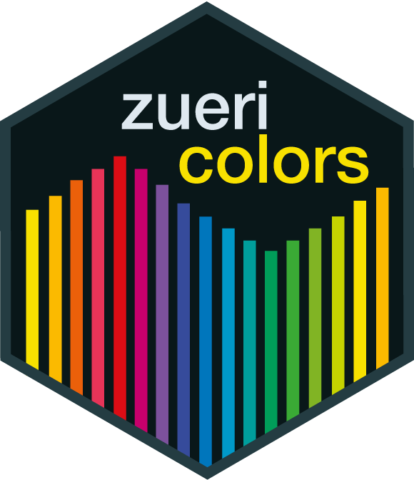
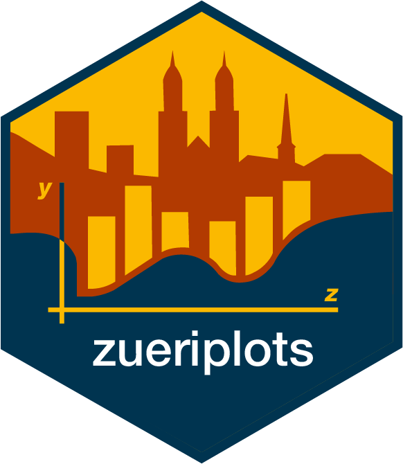
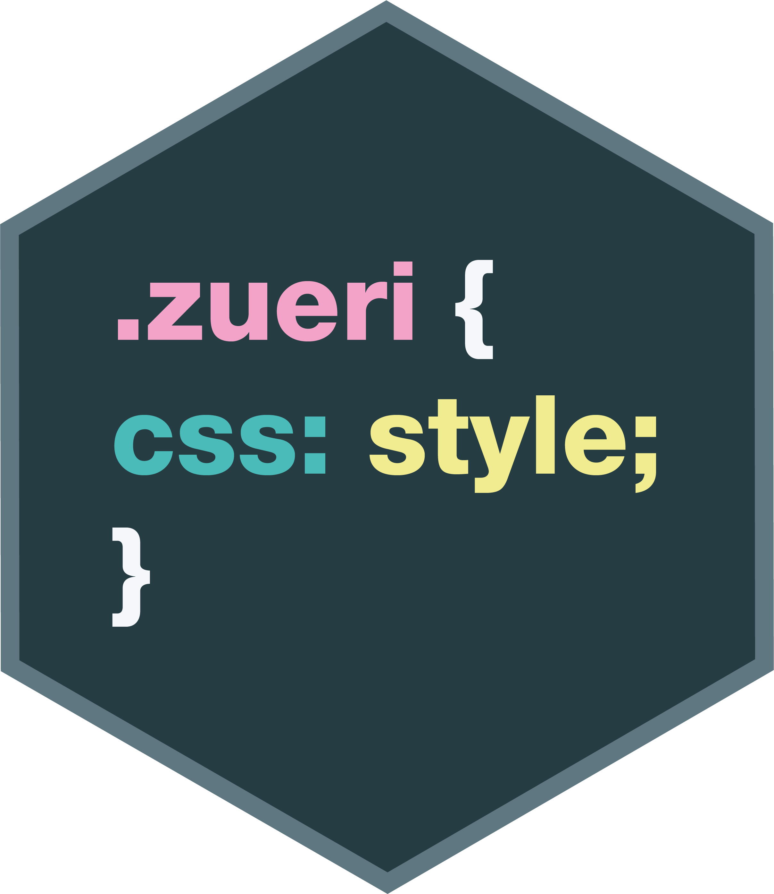

# zueriverse 

<!-- badges: start -->

<!-- badges: end -->

Zueriverse is a collection of packages aimed at employees of the city of Zurich using R. These packages help to create outputs such as graphics, reports or shiny applications that conform to the city's style guidelines. 

Zueriverse itself provides no exported functionality, it serves documentation purposes, gathering the information about all packages in one place. The following packages are part of zueriverse:

## zuericolors 

Zuericolors provides color palettes according to the corporate design of the city of Zurich, including grey scale, qualitative, sequential, and divergent palettes as well as specific palettes to be used for gender and origin.
Please consult the [documentation](https://statistikstadtzuerich.github.io/zuericolors/), and you can browse the source code and install the package from the [zuericolors github repository](https://github.com/StatistikStadtZuerich/zuericolors).

## zueritheme 

Zueritheme provides a ggplot theme to create graphics that conform to the corporate design of the city of Zurich.
Please consult the [documentation](https://statistikstadtzuerich.github.io/zueritheme/), and you can browse the source code and install the package from the [zueritheme github repository](https://github.com/StatistikStadtZuerich/zueritheme).

## zueriplots 

Zueriplots shows how zuericolors and zueritheme can be used to generate a number of different graphic types that conform to the corporate design of the city of Zurich. It does not provide additional functionality but shows examples.
Please consult the [documentation](https://statistikstadtzuerich.github.io/zueriplots/), and you can browse the source code and install the package from the [zueriplots github repository](https://github.com/StatistikStadtZuerich/zueriplots).

## zuericssstyle 

Zuericssstyle provides CSS styling for html reports or anything that uses html dependencies, as well as Shiny widgets styled with those CSS properties, allowing the users to create Shiny applications that conform to the corporate design of the city of Zurich.
Please consult the [documentation](https://statistikstadtzuerich.github.io/zuericssstyle/), and you can browse the source code and install the package from the [zuericssstyle github repository](https://github.com/StatistikStadtZuerich/zuericssstyle).

## zueridown 

Zueridown allows the user to generate PDF reports that conform to the corporate design of the city of Zurich.
Please consult the [documentation](https://statistikstadtzuerich.github.io/zueridown/); as the package contains a proprietary font, the [zueridown github repository](https://github.com/StatistikStadtZuerich/zueridown) does not contain the actual package. If you need access, please contact [statistik@zuerich.ch](mailto:statistik@zuerich.ch).

## Getting Help
If you encounter a bug, please contact [statistik@zuerich.ch](mailto:statistik@zuerich.ch).
